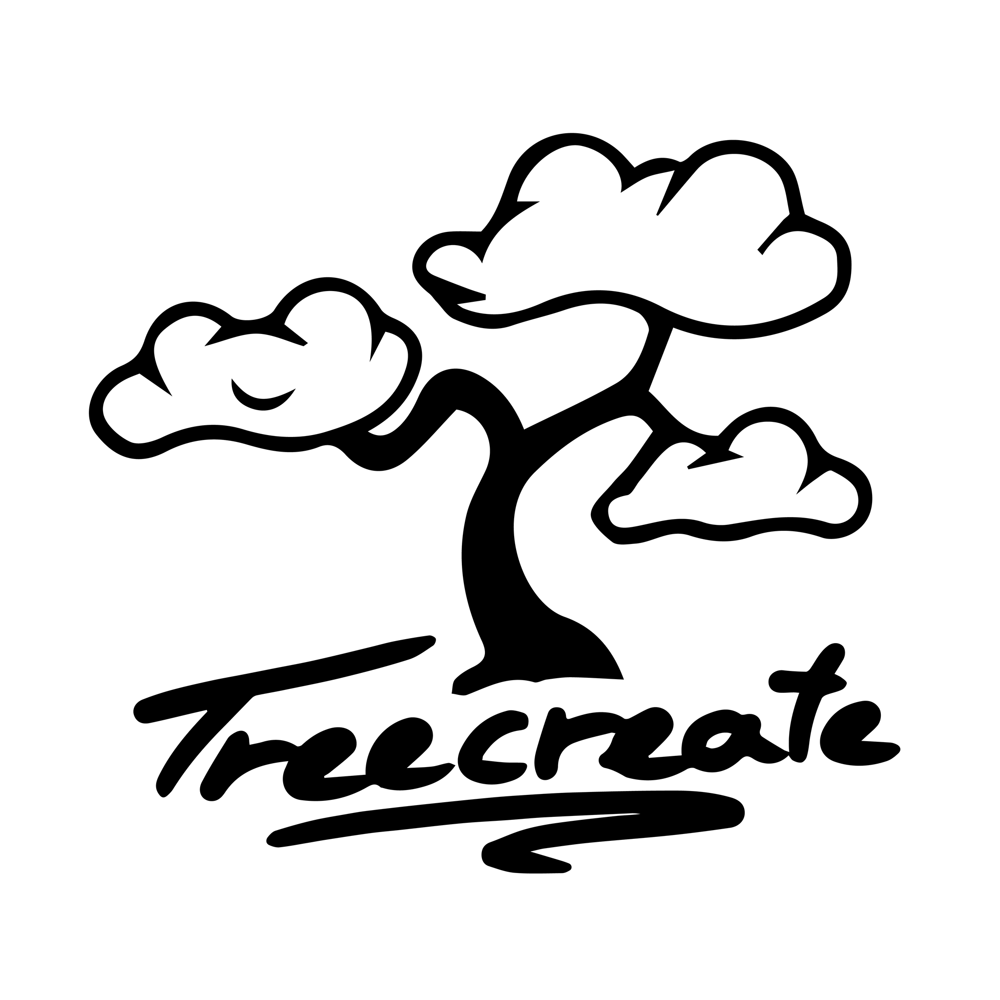

<!-- PROJECT LOGO -->
<br />
<p align="center">
  <a href="https://github.com/treecreate/webstore">
    
  </a>

  <h3 align="center">Treecreate Webstore</h3>

  <p align="center">
    A web store where you can design and buy your own family tree, engraved in wood with a laser
    <br />
    <a href="https://github.com/treecreate/webstore/docs"><strong>Explore the docs »</strong></a>
    <br />
    <br />
    ·
    <a href="https://github.com/treecreate/webstore/issues">Report Bug</a>
    ·
    <a href="https://github.com/treecreate/webstore/issues">Request Feature</a>
    ·
  </p>
</p>

<!-- TABLE OF CONTENTS -->

## Table of Contents

- [About the Project](#about-the-project)
  - [Built With](#built-with)
- [Getting Started](#getting-started)
  - [Prerequisites](#prerequisites)
  - [Installation](#installation)
  - [API documentation](#api-documentation)
- [License](#license)
- [Contact](#contact)

<!-- ABOUT THE PROJECT -->

## About The Project

Treecreate webstore is a monorepo consisting of multiple apps working together

Key points

- An api built with Java Springboot, with MySQL for persistance
- A frontend app built with Angular
- All apps are contained within a NX monorepo for easy management

This project is an improved version of our [previous repository](https://github.com/Kwandes/treecreate), with the frontend and backend split into separate apps.

### Built With

- [NX](https://nx.dev/) - a modern mono-repo generation and management tool
- [Java Springboot](https://spring.io/projects/spring-boot) and a [NX schematic for it](https://github.com/tinesoft/nxrocks/tree/develop/packages/nx-spring-boot)
- [Angular](https://angular.io/)

<!-- GETTING STARTED -->

## Getting Started

The repository is made as a monorepo using NX. The applications are located in the /apps directory

### Prerequisites

In order to run this project locally and develop it, you need to have Node and JDK installed.\

#### Node

We strongly suggest installing Node via NVM.\
It allows easy updates of Node, which is critical for NX to work properly. We develop using the latest stable releases.

- [Get NVM for Linux/Mac](https://github.com/nvm-sh/nvm)
- [Get NVM for Windows](https://github.com/coreybutler/nvm-windows)

#### Java

We develop with Java 11. Make sure your JDK is >= 11.

#### Other

- npm

```sh
npm install npm@latest -g
```

- nx

```sh
npm install -g nx
```

Commits are made with `git-cz`, a wrapper for `git commit`

```shell
npm install -g git-cz
```

_If you install it locally, you will have to use `npx git cz` instead_

### Installation

1. Clone the repo

```sh
git clone https://github.com/treecreate/webstore.git
```

2. Install NPM packages

```sh
npm install
```

3. Serve the apps via NX

```
nx serve api
nx serve webstore
```

## Api Documentation

The api features auto-generated documentation using Swagger UI.\
It can be accessed at [`localhost:5000/docs`](localhost:5000/docs) when the api is running

<!-- CONTACT -->

## How to set this up yourself

Are you interested how we set up the project and what commands we used? Checkout [our setup guide](docs/setup-guide.md)

## Contact

Email: info@treecreate.dk\
[Facebook](https://www.facebook.com/TreeCreate.dk)\
[Instagram](https://www.instagram.com/treecreate.dk)

<!-- LICENSE -->

## License

Distributed under the MIT License. See `LICENSE` for more information.

<!-- MARKDOWN LINKS & IMAGES -->
<!-- https://www.markdownguide.org/basic-syntax/#reference-style-links -->

[product-screenshot]: assets/screenshot.gif
